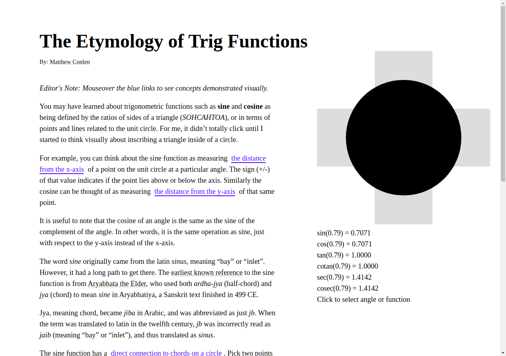

# trig

Interactive documents related to trigonometry.



## About

An interactive explorable explanation of trigonometric functions and their etymology. Built with [Idyll](https://idyll-lang.org/), the article covers:

- How **sine** and **cosine** relate to the unit circle
- The historical origins of trig function names, from Sanskrit (*ardha-jya*) through Arabic (*jiba*) to Latin (*sinus*)
- Interactive visualizations — mouseover links to see concepts demonstrated visually
- Connections between trig functions and geometric constructions (chords, tangent lines, secant lines)

## Getting Started

```bash
npm install
npm start
```

## Build

```bash
npm run build
```
